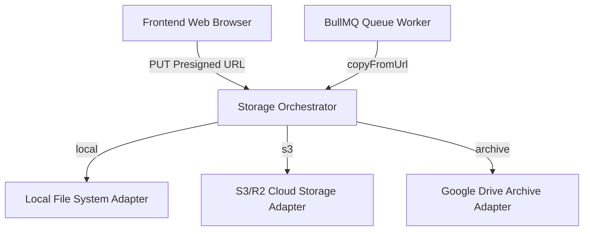

# Storage Architecture — BT Studio AI Workspace V0.4

This document describes the scalable, multi-adapter storage architecture implemented in BT Studio AI Workspace V0.4.

---

## Architecture Overview



To support both seamless local development and highly scalable production setups (e.g. AWS S3, Cloudflare R2, MinIO), the storage layer is designed around an abstract **Provider Interface**.

---

## 1. Storage Interface

The storage contract is defined in `storage.types.ts`:

```typescript
export interface StorageProvider {
  createPresignedUpload(projectId: string, assetId: string, versionNumber: number, filename: string, mimeType: string): Promise<PresignedUpload>;
  createSignedDownload(fileKey: string, expiresInSeconds?: number): Promise<string>;
  putObject(fileKey: string, body: Buffer | ArrayBuffer | string, mimeType: string): Promise<StoredObject>;
  copyFromUrl(url: string, fileKey: string, mimeType: string): Promise<StoredObject>;
  deleteObject(fileKey: string): Promise<void>;
}
```

---

## 2. Adapters

### A. Local Filesystem Provider (`local.storage.ts`)
- **Use Case**: Seamless local development with zero external dependencies.
- **Behavior**: Emulates presigned S3 URLs by routing uploads to `/api/storage/local-upload` where a memory-efficient Node.js stream writes the file directly to the workspace (`uploads/` folder).

### B. S3 Cloud Provider (`s3.storage.ts`)
- **Use Case**: Scalable production asset hosting (Cloudflare R2, AWS S3, MinIO).
- **Behavior**: Employs `@aws-sdk/client-s3` and `@aws-sdk/s3-request-presigner` to create authenticated `PUT` upload URLs and download signed links.

### C. Google Drive Archive Provider (`google-drive.storage.ts`)
- **Use Case**: Optional secondary backup/archiving only.
- **Behavior**: Automatically replicates finalized project outputs into a structured Drive folder structure.

---

## 3. Directory Layout Strategy

Asset versions are stored using a deterministic, highly organized path format:

`projects/{projectId}/assets/{assetId}/versions/v{versionNumber}/{filename}`

This ensures version control isolates previous creations and prevents collisions across multiple projects or assets.
